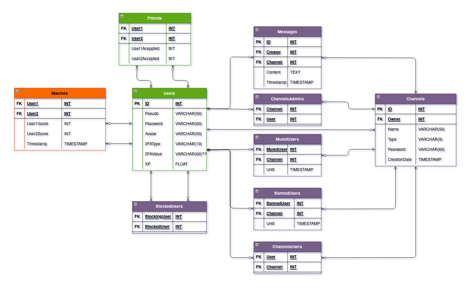

# TRANSCENDENCE

This is the last mandatory project of the 42 school.
The goal is to create a complete, full featured website to organize a *Pong* competition.
We have to use the NestJS backend framework.
We were free to choose any typescript frontend framework, we choose Vue.js with Quasar

Feel free to read the subject for more information

## Features :

## Architecture :

## Database :

